# Arquitectura del Sistema - Vecino Alerta

## Diagrama de Arquitectura

```mermaid
graph TB
    subgraph "Capa de Presentación"
        MobileApp["📱 Mobile App<br/>(Flutter)"]
        WebPanel["💻 Web Panel<br/>(React + Vite)"]
    end
    
    subgraph "Capa de Autenticación"
        FirebaseAuth["🔐 Firebase Auth<br/>(Phone Auth)"]
    end
    
    subgraph "Capa de Backend"
        CloudFunctions["☁️ Cloud Functions<br/>(Node.js v20)"]
        Firestore["🗄️ Firestore<br/>(Database)"]
        FCM["📬 Firebase Cloud Messaging"]
        Storage["📦 Firebase Storage"]
    end
    
    subgraph "Capa de Hardware"
        ESP32["🔌 ESP32 Firmware<br/>(C++/Arduino)"]
        Siren["🚨 Physical Siren"]
    end
    
    MobileApp -->|"Phone Auth"| FirebaseAuth
    WebPanel -->|"Email/Password"| FirebaseAuth
    
    MobileApp -->|"triggerEmergency<br/>createSilentReport"| CloudFunctions
    WebPanel -->|"getHeatmapData<br/>manageBarrios"| CloudFunctions
    
    CloudFunctions -->|"Read/Write"| Firestore
    CloudFunctions -->|"Send Notifications"| FCM
    CloudFunctions -->|"Store PDFs"| Storage
    CloudFunctions -->|"HTTP POST"| ESP32
    
    FCM -->|"Push Notifications"| MobileApp
    
    ESP32 -->|"Poll Status"| CloudFunctions
    ESP32 -->|"Activate/Deactivate"| Siren
    
    Firestore -.->|"Security Rules<br/>(RBAC)"| MobileApp
    Firestore -.->|"Security Rules<br/>(RBAC)"| WebPanel
```

## Flujo de Datos Principal

### 1. Flujo de Emergencia (Botón Rojo)

```mermaid
sequenceDiagram
    participant User as 👤 Usuario
    participant App as 📱 App Móvil
    participant CF as ☁️ Cloud Functions
    participant DB as 🗄️ Firestore
    participant FCM as 📬 FCM
    participant ESP as 🔌 ESP32
    participant Siren as 🚨 Sirena
    
    User->>App: Presiona Botón Rojo
    App->>App: Countdown 5s
    App->>CF: triggerEmergency()
    CF->>DB: Crear incidente
    CF->>FCM: Enviar notificación
    CF->>ESP: POST /activate
    ESP->>Siren: GPIO HIGH
    FCM->>App: Notificación Push
    Siren-->>User: 🔊 Alarma Activa
```

### 2. Flujo de Reporte Silencioso

```mermaid
sequenceDiagram
    participant User as 👤 Usuario
    participant App as 📱 App Móvil
    participant CF as ☁️ Cloud Functions
    participant DB as 🗄️ Firestore
    participant Panel as 💻 Web Panel
    
    User->>App: Completa formulario
    App->>CF: createSilentReport()
    CF->>DB: Guardar incidente
    DB-->>Panel: Actualización en tiempo real
    Panel-->>Panel: Mostrar en Dashboard
```

### 3. Flujo de Autenticación

```mermaid
sequenceDiagram
    participant User as 👤 Usuario
    participant App as 📱 App Móvil
    participant Auth as 🔐 Firebase Auth
    participant DB as 🗄️ Firestore
    
    User->>App: Ingresa teléfono
    App->>Auth: verifyPhoneNumber()
    Auth->>User: SMS con código
    User->>App: Ingresa OTP
    App->>Auth: verifyOTP()
    Auth->>App: Token + Custom Claims
    App->>DB: Acceso según rol
```

## Componentes del Sistema

### Mobile App (Flutter)
- **Screens:** Login, Home, PanicConfirm, SilentReport, Success
- **Services:** LocationService, EmergencyService
- **Providers:** AuthProvider (Phone Auth)
- **Features:** GPS, FCM, Offline caching

### Web Panel (React + Vite)
- **Pages:** LoginPage, ComiteDashboard, SuperAdminDashboard
- **Features:** Heatmap (recharts), PDF Export (jsPDF), Real-time updates
- **Auth:** Firebase Auth (Email/Password)

### Backend (Firebase Cloud Functions v2)
- **Functions:**
  - `triggerEmergency`: Activa sirena y notifica
  - `cancelEmergency`: Desactiva sirena
  - `createSilentReport`: Guarda reporte
  - `getHeatmapData`: Retorna coordenadas
  - `generateMonthlyReport`: PDF mensual (scheduler)
- **Services:** SirenService (HTTP client)

### Hardware (ESP32 Firmware)
- **Connectivity:** WiFi + HTTP polling
- **Control:** GPIO para relay de sirena
- **Config:** WiFi credentials, API endpoint

## Seguridad

### Firestore Security Rules
- **RBAC:** Roles `superadmin`, `comite`, usuario regular
- **Validación:** Estructura de datos, tipos, campos requeridos
- **Restricciones:** Read/Write basado en custom claims

### Autenticación
- **Mobile:** Phone Auth (SMS)
- **Web:** Email/Password
- **Custom Claims:** Asignados vía `setRole.ts` script

## Deployment

### CI/CD (GitHub Actions)
- **backend-test.yml:** Tests automáticos
- **deploy-staging.yml:** Deploy a Firebase
- **mobile-build.yml:** Build APK

### Scripts
- **deploy.sh:** Deploy unificado (Functions + Hosting)
- **setRole.ts:** Asignar roles a usuarios

## Escalabilidad

- **Firestore:** Auto-scaling, índices optimizados
- **Cloud Functions:** Concurrencia automática
- **FCM:** Millones de notificaciones
- **Multi-barrio:** Arquitectura preparada para múltiples comunidades
